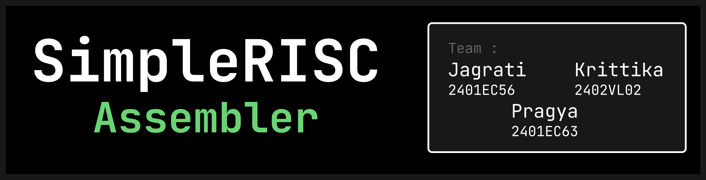

# ⚙️ SimpleRISC Assembler
<p align="center">
  
</p>

---
### 🌐 Live Demo

* The application is deployed using Streamlit and can be accessed here:  
[SimpleRisc-Assembler](https://simplerisc-asm.streamlit.app/)
  
---

### 📌 Overview
* A Python-based assembler for a SimpleRISC architecture
* Converts assembly instructions into binary machine code
* Implements instruction parsing, validation, and encoding
* Supports arithmetic, logical, and memory operations
* Handles registers, immediate values, and addressing modes
  
---

### ⚙️ Installation & Setup
1.**Clone the repository**:
```bash
git clone https://github.com/jagrati7305/SimpleRISC_Assembler
cd SimpleRISC_Assembler
```
2. **Install Dependencies**:
```bash
pip install -r requirements.txt
```
2. **Run the Application**:
```bash
streamlit run main.py
```
---

### 📂 Project Structure

```text
SimpleRISC_Assembler/
├── .streamlit/             # Streamlit UI configuration & themes
├── assets/                 # Static assets 
├── views/                  # UI page layouts
│   └── main_page.py        # Code Editor Page
│   └── explanation_page.py # Code Explanation Page
├── assembler.py            # Main Assembler Logic
├── main.py                 # Application entry point
├── requirements.txt        # Python dependencies
├── test_case.asm           # Sample Asm File
└── README.md
```
---